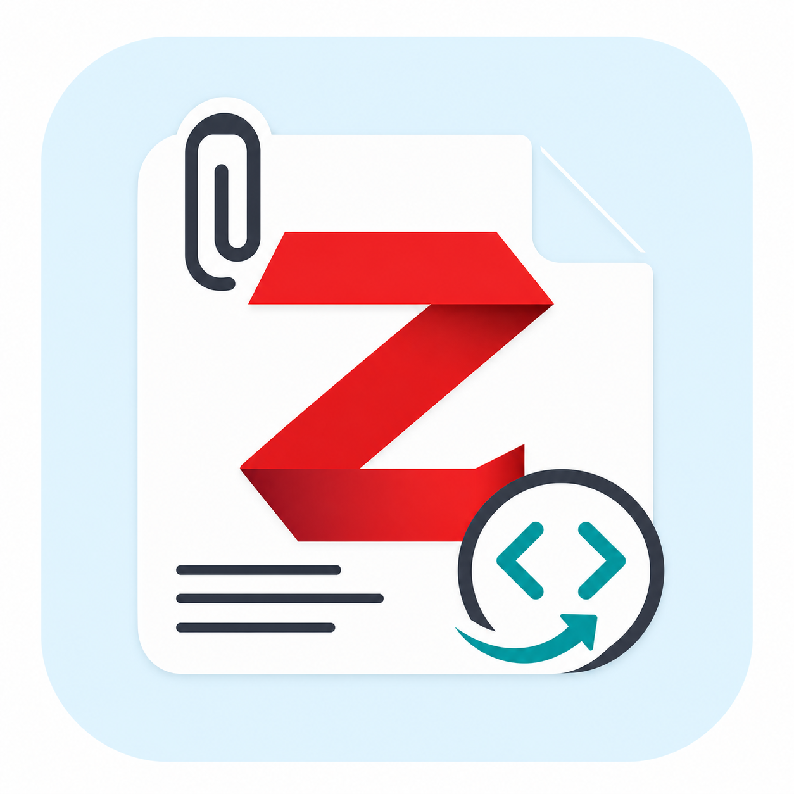
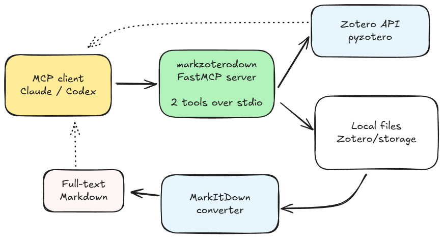

# markzoterodown

<p align="center">
  
</p>

[](https://pypi.org/project/markzoterodown/)
[](https://pypi.org/project/markzoterodown/)
[](LICENSE)

An MCP server that gives AI agents **full-text Markdown access** to files
attached to your Zotero library items.

markzoterodown handles the attachment content layer: it resolves Zotero
attachment paths on disk and converts PDFs, DOCX files, PPTX files, HTML, and
other formats to Markdown with
[MarkItDown](https://github.com/microsoft/markitdown).

Use it with a Zotero search/browse MCP server: search for an item key there,
then read its attached files here.

## Tools

| Tool | Description |
|---|---|
| `list_item_attachments` | List file attachments for a Zotero item, including attachment keys, filenames, MIME types, link modes, and resolved local paths. |
| `get_attachment_as_markdown` | Convert a Zotero attachment to Markdown. Supports local Zotero files and `linked_url` attachments. |

## Quick Start

Install nothing manually. Most MCP clients can run the PyPI package directly:

```bash
uvx markzoterodown
```

The universal MCP values are:

| Field | Value |
|---|---|
| Server name | `zotero-fulltext` |
| Command | `uvx` |
| Arguments | `markzoterodown` |
| Required env | `ZOTERO_LIBRARY_ID`, plus `ZOTERO_API_KEY` unless using `ZOTERO_USE_LOCAL=true` |

For copy-paste setup across Claude, Codex, Cursor, Gemini CLI, Windsurf,
VS Code, OpenCode, MetaMCP, and other clients, see:

**[Agent setup guide](docs/setup.md)**

## Zotero Credentials

For the Zotero web API, open
[zotero.org/settings/keys](https://www.zotero.org/settings/keys):

- `ZOTERO_LIBRARY_ID`: the number under "Your userID for use in API calls"
- `ZOTERO_API_KEY`: create a private key with library read access
- `ZOTERO_LIBRARY_TYPE`: use `user` or `group`

For Zotero Desktop's local API, enable local API access in Zotero and set:

```text
ZOTERO_USE_LOCAL=true
ZOTERO_LIBRARY_ID=<your user or group ID>
```

The local API requires Zotero Desktop to be running.

## Configuration

All runtime configuration is via environment variables:

| Variable | Default | Description |
|---|---|---|
| `ZOTERO_LIBRARY_ID` | required | Numeric Zotero user or group ID. |
| `ZOTERO_API_KEY` | `""` | Zotero API key. Usually omitted when using the local API. |
| `ZOTERO_LIBRARY_TYPE` | `user` | Use `user` or `group`. |
| `ZOTERO_USE_LOCAL` | `false` | Set `true` to use Zotero Desktop's local API on port 23119. |
| `ZOTERO_STORAGE_PATH` | `~/Zotero/storage` | Directory where Zotero stores synced attachment files. |

## Workflow

```text
zotero_search("gypsum sorption")          # another Zotero MCP
  -> item key: BZPBTWVU

list_item_attachments("BZPBTWVU")         # this server
  -> attachment key: AE7VF5JI
     filename: Wilkes 2004.pdf

get_attachment_as_markdown("AE7VF5JI")    # this server
  -> full Markdown text of the paper
```

## Architecture



## Troubleshooting

- If your MCP client cannot find `uvx`, use the absolute path from `which uvx`
  or `where.exe uvx`.
- If an attachment returns "file not found", download/sync the file in Zotero
  on the same machine that runs the MCP server.
- If the Zotero API returns `403`, regenerate your API key with library read
  access.
- For group libraries, set `ZOTERO_LIBRARY_TYPE=group` and use the group's
  numeric ID.

More client-specific notes are in the
**[agent setup guide](docs/setup.md#troubleshooting)**.

## Development

Contributor setup, local checkout MCP config, build, publish, and release notes
live in the **[development guide](docs/development.md)**.

## License

MIT
